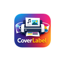

  

<h1 align="center">CoverLabel</h1>

  Imprime etiquetas y portadas de colecciones al tamaño exacto — videojuegos, CDs, DVDs, libros y más.

  
  
  
  

---

## ¿Qué es CoverLabel?

**CoverLabel** es una herramienta gratuita para imprimir portadas y etiquetas de colecciones al tamaño exacto, directamente desde el navegador o como app de escritorio. Diseñada para coleccionistas que quieren reproducir cajas, inlays, spines o carátulas con precisión milimétrica.

Funciona **sin servidor**, **sin cuenta** y **sin conexión** una vez cargada.

---

## Casos de uso

| Colección | Ejemplo |
|-----------|---------|
| 🎮 Videojuegos retro | Carátulas NES, SNES, Mega Drive, Neo Geo AES/MVS, Game Boy |
| 💿 Música | Portadas de CD, inlays interiores, carátulas de vinilo |
| 📀 Cine y series | Cubiertas de DVD, Blu-ray, VHS |
| 📚 Libros y cómics | Sobrecubiertas, lomos, marcapáginas |
| 🎲 Juegos de mesa | Cartas, tokens, reglamentos a medida |
| 🏷️ Etiquetas | Spine labels, price tags, cualquier etiqueta personalizada |

---

## Características

### Modos de impresión

- **Cuadrícula automática** — ajusta múltiples copias de la imagen por página, aprovechando al máximo el papel
- **Modo División** — divide portadas grandes (p. ej. Neo Geo AES 184×267 mm) en varios trozos para imprimir en A4 y ensamblarlas
- **Modo Póster** — imprime a tamaño A3 completo, o distribuye la imagen en 4 hojas A4 para montar un póster
- **Cajas Repro Neo Geo AES** — plantillas A4 listas para recortar y montar, cortesía de [TipitoChen](https://www.youtube.com/@tipitochen) en YouTube

### Tamaños de papel
A4 · A5 · A3 · Carta (US Letter) · con detección automática según las dimensiones introducidas

### Espaciado independiente
Define el espacio **entre columnas** y **entre filas** por separado (mm) para aprovechar al máximo cada hoja según el formato de tu etiqueta.

### Exportación
- **PDF** listo para imprimir (máxima calidad, vectorial)
- **PNG** para retoque o compartir
- **SVG** vectorial con la imagen embebida (modo cuadrícula estándar)
- **Marcas de registro** en las esquinas de la página, para alineación profesional de impresión

### Configuración de imagen
- Márgenes ajustables (0–30 mm)
- Escala libre o encaje automático
- Rotación 0–360°
- Opción para invertir imagen en espejo
- **Retoque en vivo**: brillo, contraste, saturación y nitidez, aplicado en la vista previa y en todas las exportaciones

### Texto sobre portada y lomo
Añade capas de texto (título, número de cartucho, texto de lomo…) con posición, tamaño, giro, color, contorno y alineación ajustables. Se imprime junto a la imagen en PDF, PNG y SVG. Disponible en el modo estándar **y en las cajas Neo Geo AES**.

### Plantillas personalizadas
Guarda tus propios tamaños como plantilla (localStorage), reutilízalos desde el selector de formato, y expórtalos/impórtalos como JSON para compartirlos o hacer copia de seguridad.

### Interfaz y comodidad
- **Modo oscuro automático** (según el sistema) con interruptor manual en la cabecera
- **Multi-idioma**: español, inglés, portugués y francés
- **Recuerda tu última sesión** (papel, dimensiones, márgenes, textos…) al reabrir
- **Zona segura** opcional (margen interior de 3 mm) para no cortar contenido importante
- Buscador rápido de consola/formato en el selector de plantillas
- Optimización automática de imágenes muy grandes (mejor rendimiento en móvil)

### PWA / Sin conexión
**App instalable** desde el navegador (manifest + service worker). Funciona 100% offline tras la primera carga; las imágenes nunca salen de tu dispositivo.

### Plantillas de la comunidad
La pestaña **Comunidad** en el modal de Cajas Repro permite explorar, votar y usar plantillas SVG creadas por otros usuarios. Las plantillas incluidas inicialmente son cortesía del blog [**el cuarto de Toby**](https://elcuartodetoby.blogspot.com/p/cajas-custom.html).

¿Tienes una plantilla propia? ¡Súbela y ayuda a crecer esta biblioteca entre todos! Las mejores plantillas suben en el ranking por votación de la comunidad.

---

## Descargas

| Plataforma | Archivo | Notas |
|------------|---------|-------|
| **Windows** (instalador) | [CoverLabel Setup.exe](https://github.com/JFSAINTS/coverlabel/releases/latest) | Con acceso directo en escritorio |
| **Windows** (portátil) | [CoverLabel.exe](https://github.com/JFSAINTS/coverlabel/releases/latest) | Sin instalación, ejecutar directo |
| **Android** | [CoverLabel.apk](https://github.com/JFSAINTS/coverlabel/releases/latest) | Requiere permitir fuentes desconocidas |
| **Web / PWA** | [Abrir en el navegador](https://coverlabel.netlify.app) | Funciona en cualquier dispositivo |

---

## Cómo usar

1. **Abre** la app (web, .exe o APK)
2. **Arrastra** una imagen o usa el botón para cargarla
3. **Introduce** el ancho y alto en milímetros de tu portada/etiqueta
4. **Ajusta** márgenes, escala y rotación si es necesario
5. **Exporta** como PDF o PNG, o imprime directamente

### Modo División (portadas grandes)
Si la portada no cabe en una hoja A4, activa **División** → el sistema calcula automáticamente en cuántas partes dividir la imagen y genera una página por trozo con guías de ensamblaje.

### Modo Póster
Activa **Póster** → elige entre imprimir a **A3** (una hoja grande) o distribuir la imagen en **4 hojas A4** para montar un póster de 420×594 mm.

---

## Tecnología

- HTML + CSS + JavaScript puro (sin frameworks)
- [jsPDF](https://github.com/parallax/jsPDF) para exportación PDF
- [Electron](https://www.electronjs.org/) para la app de escritorio Windows
- [Capacitor](https://capacitorjs.com/) para la app Android
- PWA con Service Worker para uso offline

---

## Privacidad

Toda la app corre **100% en local**. Las imágenes que cargas no se envían a ningún servidor. No hay analíticas ni rastreo.

---

## Licencia

MIT — libre para uso personal y comercial.

---

## Contacto

Desarrollado por [@_SAINTS_](https://x.com/_SAINTS_) en X / Twitter.
